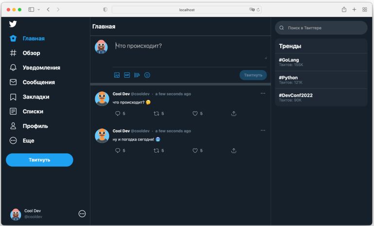

# Корпоративный сервис микроблогов

## Описание
Приложение представляет собой сервис микроблогов, статические страницы которого реализованы в  
проекте [Tweeter clone](https://github.com/kaanersoy/twitter-clone.git). Бекэнд проекта реализован с помощью 
асинхронного фреймворка FastAPI. В качестве HTTP-сервера и обратного прокси-сервера используется Nginx. 
Для хранения информации используется база данных PostgreSQL.

Система регистрации пользователей осуществляется отдельно от проекта.
Авторизация пользователя в системе микроблогов осуществляется по api-key, 
передаваемому в заголовке HTTP-запроса.

Сервис представляет собой следующую страницу.


## Функциональные возможности API:
API предоставляет следующие возможности:

1. Создание твита.
2. Удаление твита.
3. Подписаться на пользователя.
4. Отписаться от пользователя.
5. Поставить отметку "Нравится" на твит.
6. Убрать отметку "Нравится" с твита.
7. Получить ленту твитов.
8. Добавление картинки к твиту.

Документация к методам API доступна после развертывания приложения по ссылке
[localhost:8000/docs](localhost:8000/docs "localhost:8000/docs")

## Разворачивание приложения

* Клонирование репозитория
 ```commandline
   git clone https://github.com/Sergei-V-Fedorov/MedicalAPI.git
 ```

## Разворачивание приложения
1. docker compose 